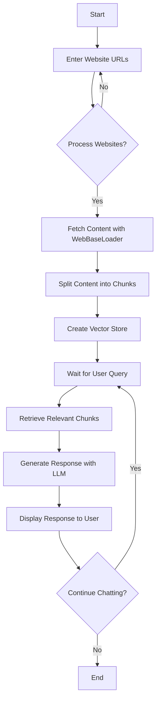

# Multi-Website Chatbot

This Streamlit application allows users to chat with an AI assistant that has knowledge from multiple websites. The app uses LangChain and OpenAI's GPT models to process website content and generate responses based on user queries.

## Features

- Process multiple websites simultaneously
- Chat interface for querying processed website content
- Sample links for quick testing
- Comprehensive error handling and user feedback

## Installation

1. Clone this repository:
   ```
   git clone https://github.com/yourusername/multi-website-chatbot.git
   cd multi-website-chatbot
   ```

2. Install the required packages:
   ```
   pip install streamlit langchain langchain-openai chromadb
   ```

3. Set up your OpenAI API key:
   - Create a `.env` file in the project root
   - Add your OpenAI API key: `OPENAI_API_KEY=your_api_key_here`

## Usage

1. Run the Streamlit app:
   ```
   streamlit run app.py
   ```

2. Open your web browser and go to the URL provided by Streamlit (usually `http://localhost:8501`)

3. In the sidebar:
   - Enter website URLs (one per line) in the text area, or
   - Click "Try with sample links" to use pre-defined sample URLs

4. Click "Process Websites" to load and process the websites

5. Once processing is complete, you can start chatting with the AI about the content of the processed websites

## How it Works

1. **Website Processing**:
   - The app uses LangChain's WebBaseLoader to fetch content from the provided URLs
   - The content is split into smaller chunks using RecursiveCharacterTextSplitter
   - These chunks are then embedded and stored in a Chroma vector store

2. **Query Processing**:
   - When a user asks a question, the app uses a retriever to find relevant chunks from the vector store
   - These chunks provide context for the language model to generate a response

3. **Response Generation**:
   - The app uses OpenAI's GPT-3.5-turbo model to generate responses
   - The model is given the context from the retrieved chunks and the chat history
   - It then generates a response based on this information

## Flow Chart

The following flow chart illustrates the main steps of the Multi-Website Chatbot process:



This flow chart provides a high-level overview of how the Multi-Website Chatbot processes information and interacts with the user.

## Key Components

- `get_vectorstore_from_urls(urls)`: Processes multiple websites and creates a vector store
- `get_context_retriever_chain(vector_store)`: Creates a retriever chain for finding relevant context
- `get_conversational_rag_chain(retriever_chain)`: Sets up the conversational retrieval-augmented generation chain
- `get_response(user_input)`: Generates a response to the user's input

## Limitations

- The app processes only the main content of each URL, not navigating through internal links
- Very large websites may take significant time to process
- The quality of responses depends on the relevance and quality of the processed website content

## Future Improvements

- Implement caching to speed up repeated processing of the same websites
- Add support for processing PDFs and other document types
- Implement user authentication for personalized experiences
- Enhance the UI with more interactive elements and visualizations of the processed data

## Contributing

Contributions are welcome! Please feel free to submit a Pull Request.

## License

This project is licensed under the MIT License.